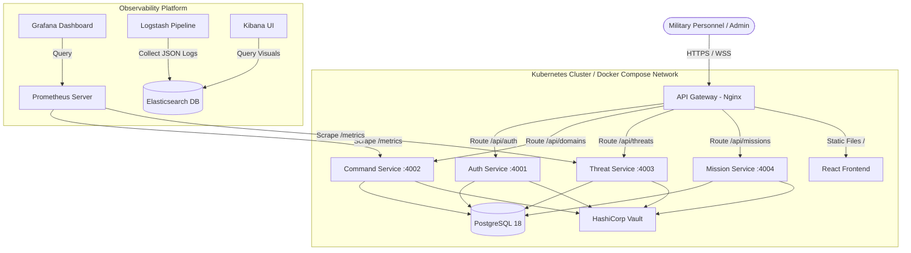
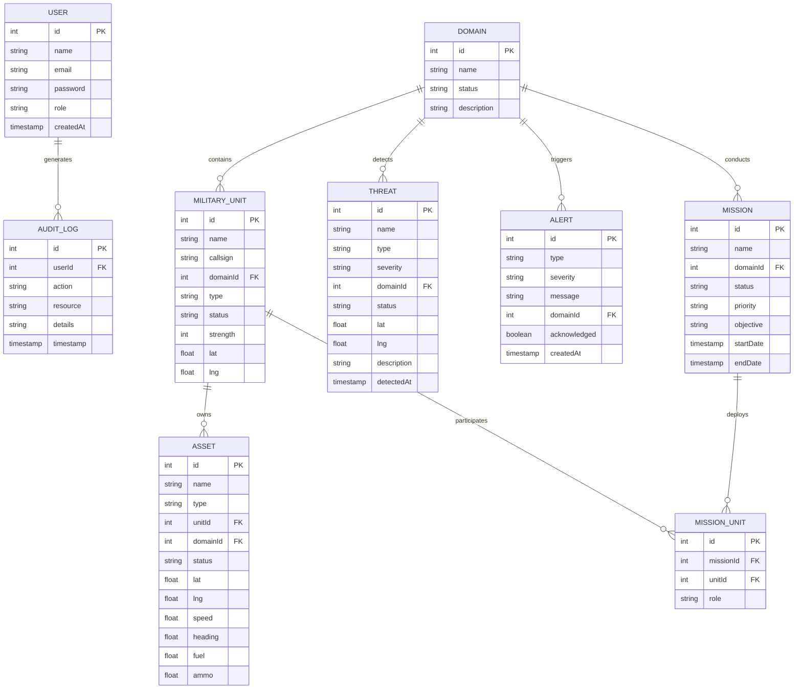

# Master Design Specification (MDS)
## Project QuantumDefense: Integrated Multi-Domain Military Command & Control Platform

**Version:** 1.0.0  
**Date:** June 2026  
**Status:** Approved  
**Author:** Lead Systems Architect  
**Case Study Reference:** Case Study 101, ITM Skills University  

---

## 1. Document Purpose & Scope
This Master Design Specification (MDS) outlines the system design, data architecture, security mechanisms, and operational strategies for Project QuantumDefense. This document acts as the technical blueprint for the development, containerization, deployment, and monitoring of the platform.

The scope of this document covers the frontend user interface, the four backing microservices, the API gateway, database schema design, and the operational environment (Docker Compose for local development and Kubernetes for production).

---

## 2. System Overview
QuantumDefense is a distributed, microservices-based application built to serve as a Common Operating Picture (COP) for military command structures. The platform processes high-velocity status telemetry from active assets, displays aggregated readiness indexes, tracks threat detections, handles operational alerts, and coordinates tactical missions across land, air, naval, cyber, and space forces.

---

## 3. Design Goals
* **Microservices Decomposition:** High cohesion, loose coupling. Services communicate asynchronously or via clear, RESTful contracts.
* **Resilience:** The application must survive container or node failures. Pods must self-heal and load-balance automatically.
* **Observability:** Centralized logging, distributed metrics, and standardized monitoring to ensure clear visibility into runtime states.
* **Zero-Trust Security:** Dynamic secrets retrieval, cryptographic storage of credentials, role-based access control (RBAC), and logical service isolation.

---

## 4. System Context
The following diagram illustrates how external users and system components interact with the QuantumDefense gateway and internal microservices:



---

## 5. Microservices Architecture
The platform is decomposed into four discrete microservices. Each service is packaged inside a lightweight Alpine Docker container running Node.js 24 LTS and uses Prisma ORM to interact with PostgreSQL 18.

### 5.1. Auth Service
* **Port:** 4001
* **Responsibilities:** Handles user sign-ups, secure login, password validation via bcrypt, and JWT creation/verification.
* **Dependencies:** Shared PostgreSQL database (`User` and `AuditLog` tables), HashiCorp Vault (for JWT secret keys).

### 5.2. Command Service
* **Port:** 4002
* **Responsibilities:** Manages the definition of operational domains, tracking of units, and telemetry of assets. Features an internal simulation engine that periodically updates coordinates, fuel, and ammunition levels. Integrates WebSockets (Socket.IO) to broadcast real-time telemetry directly to frontend map components.
* **Dependencies:** Shared PostgreSQL database, Socket.IO clients, Prometheus metrics server.

### 5.3. Threat Service
* **Port:** 4003
* **Responsibilities:** Manages threat detection logs, correlates reports, and processes active alerts. Triggers immediate WebSocket alerts to the dashboard when a threat level scales up.
* **Dependencies:** Shared PostgreSQL database, Socket.IO clients.

### 5.4. Mission Service
* **Port:** 4004
* **Responsibilities:** Manages tactical missions, assigns units to specific objective regions, and manages the state machine for mission status.
* **Dependencies:** Shared PostgreSQL database.

---

## 6. Data Architecture
QuantumDefense uses a single PostgreSQL 18 instance with logical separation. Each microservice is strictly responsible for writing to and managing its own tables, preventing database-level tight coupling.



---

## 7. Integration Architecture
### 7.1. API Gateway
Nginx acts as the single entry point for all frontend and external requests, resolving them to internal service names within the Docker Compose network or Kubernetes DNS:
* Routing `/api/auth/*` to `http://auth-service:4001`
* Routing `/api/domains/*` to `http://command-service:4002`
* Routing `/api/threats/*` to `http://threat-service:4003`
* Routing `/api/missions/*` to `http://mission-service:4004`
* Routing `/socket.io/*` to upstream WebSocket servers
* Serving static frontend files for `/`

### 7.2. Real-Time Telemetry & Alerts
* **WebSocket Framework:** Socket.IO v4.x
* **Event Channels:**
  * `telemetry:update`: Broadcasts updated asset telemetry (lat, lng, heading, fuel, ammo) every 3 seconds.
  * `alert:new`: Broadcasts high-priority operational alerts when threat levels cross predefined thresholds.
  * `threat:detected`: Pushes new threat objects directly to map components without refreshing.

---

## 8. Security Architecture
* **Token Authentication:** JSON Web Tokens (JWT) signed with HS256. The client passes this token in the `Authorization: Bearer <token>` header.
* **Role-Based Access Control (RBAC):**
  * `Commander`: Write access to missions, read-only threats/assets.
  * `Operator`: Write access to assets/telemetry, read-only missions.
  * `Analyst`: Write access to threats/alerts, read-only assets.
  * `Admin`: Write access to user configuration and operational logs.
* **HashiCorp Vault Integration:** Microservices authenticate to Vault on startup using a AppRole or Local Token, dynamically retrieving the PostgreSQL database URI and JWT private key.
* **Network Policies:** In Kubernetes, network policies block cross-pod traffic, restricting database access to authorized service pods only.

---

## 9. Monitoring & Observability Strategy
### 9.1. Metrics Collection
* **Collector:** Prometheus scrapes `/metrics` endpoints from Node.js apps (via `prom-client`) and the PostgreSQL exporter.
* **Scrape Interval:** 10 seconds.
* **Visualization:** Grafana dashboards showing:
  * Application response times and rate of HTTP 5xx errors.
  * System metrics (CPU/RAM utilization per pod).
  * Business metrics (active threats, unit readiness index, mission success rate).

### 9.2. Structured Logging
* **Logger:** Winston outputting JSON formatted logs to stdout.
* **Log Pipeline:** Filebeat/FluentBit forwards container stdout to Logstash.
* **Log Storage & UI:** Logstash filters, indexes, and forwards logs to Elasticsearch. Users query logs via Kibana.

---

## 10. Disaster Recovery Strategy
To guarantee resilient operations, QuantumDefense targets an **RTO of 15 minutes** and an **RPO of 5 minutes**.

* **Data Redundancy:** PostgreSQL database utilizes Amazon RDS Multi-AZ replication, mirroring data synchronously to a secondary Availability Zone.
* **Backups:** Automatic daily snapshots of RDS instances are stored in an S3 bucket with versioning and object lock enabled. Transaction logs are backed up every 5 minutes, satisfying the 5-minute RPO.
* **Infra Recovery:** Terraform scripts are managed in Git. If a regional outage occurs, the environment can be re-provisioned in an alternative AWS region by executing:
  ```bash
  terraform init
  terraform workspace select backup-region
  terraform apply -auto-approve
  ```
* **K8s Failover:** Route 53 routes incoming traffic to the active regional load balancer. Upon failure, a DNS swap routes requests to the secondary EKS cluster.
