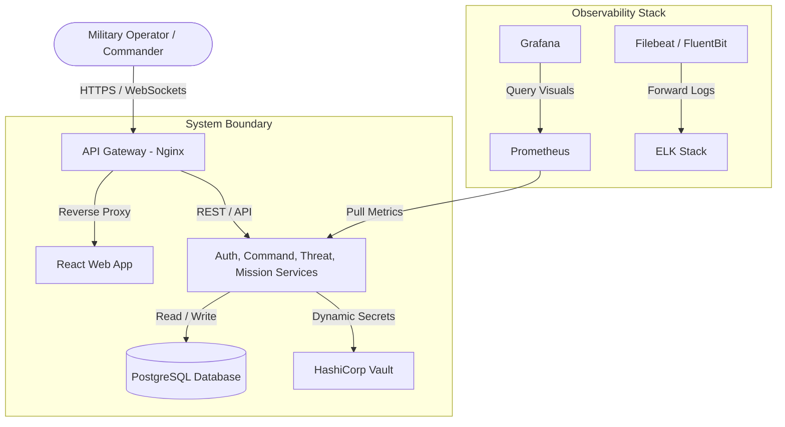
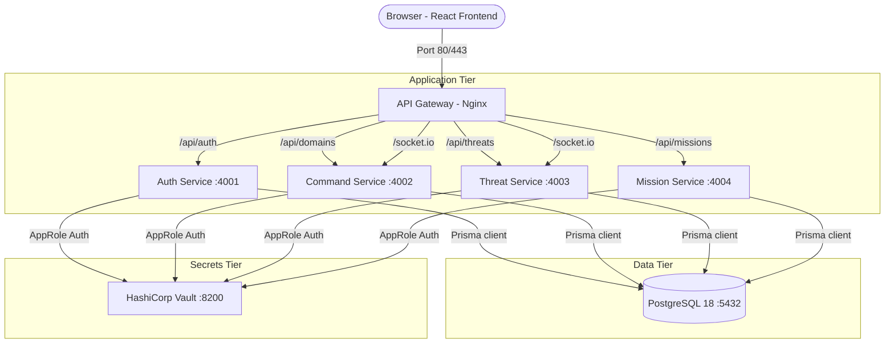
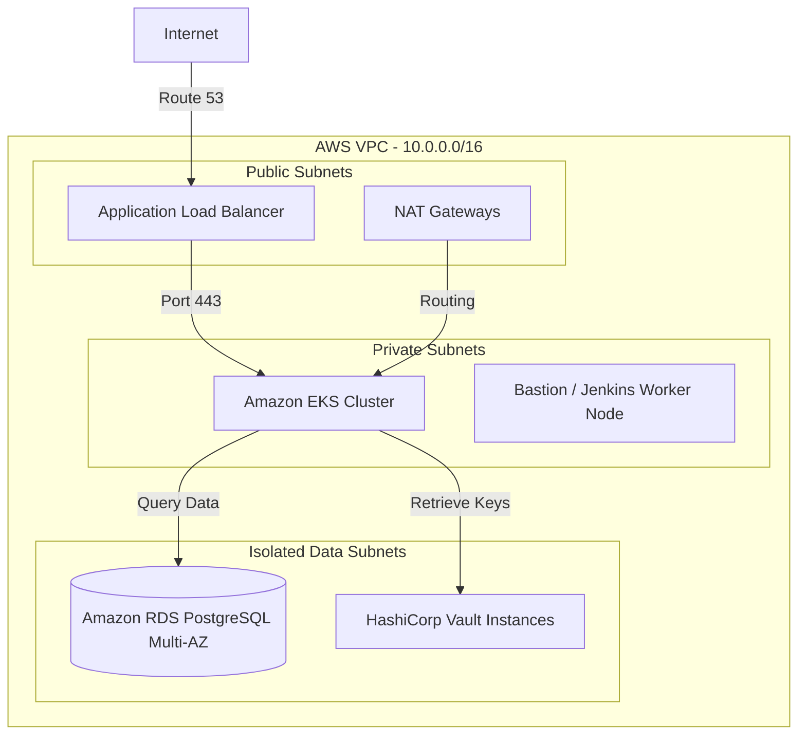
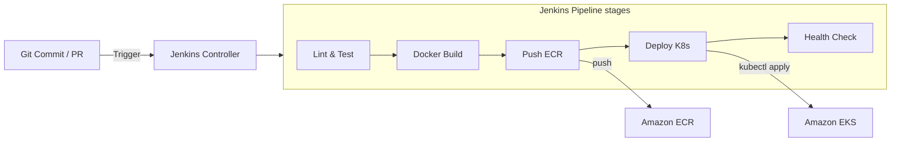
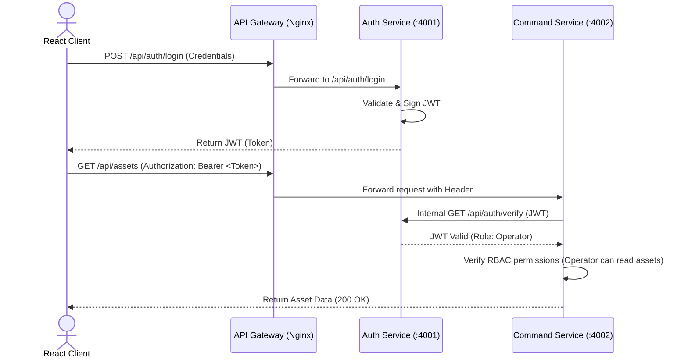

# System Architecture Document
## Project QuantumDefense: Integrated Multi-Domain Military Command & Control Platform

**Version:** 1.0.0  
**Date:** June 2026  
**Status:** Approved  
**Author:** Lead Architect  

---

## 1. Architecture Overview
Project QuantumDefense is structured around a cloud-native, containerized, microservices architecture. It decouples the core domain models of a military Command & Control (C2) system (Authentication, Assets/Units, Threats, and Missions) into independent, state-isolated, logically separated services. The design prioritizes zero single-points-of-failure (SPOF), horizontal scalability, real-time message dissemination, and robust runtime monitoring.

---

## 2. Architecture Principles
* **12-Factor App Methodology:** Config via environment variables, stateless execution, logs written as event streams, and strict separation of build/release/run phases.
* **Defense in Depth:** Security controls are implemented at the edge (Nginx), network level (K8s NetworkPolicies), process level (non-root containers), and storage level (Vault and RDS encryption).
* **Zero Trust:** Microservices do not implicitly trust inbound calls. All requests must present a validated JWT bearer token, even for service-to-service communication.
* **Loose Coupling / High Cohesion:** Services are grouped by bounded contexts (DDD), maintaining distinct database tables and communicating via standardized interfaces.

---

## 3. System Context (C4 Context)
The diagram below shows the high-level boundary of the QuantumDefense system:

---

## 4. Container Architecture (C4 Container Diagram)
This diagram details the interfaces, port bindings, and communication pathways of the container components:

---

## 5. Service Decomposition
### 5.1. Authentication Service
* **Tech Stack:** Node.js, Express, Prisma, JWT, Bcrypt.
* **Database Responsibilities:** Owns tables: `User`, `AuditLog`.
* **Exposed Ports:** 4001
* **Endpoints:**
  * `POST /api/auth/register` (Register a new account)
  * `POST /api/auth/login` (Returns signed JWT valid for 2 hours)
  * `GET /api/auth/me` (Validates current session details)
  * `GET /api/auth/verify` (Service-to-service endpoint to validate incoming JWTs)

### 5.2. Command Service
* **Tech Stack:** Node.js, Express, Socket.IO, Prisma.
* **Database Responsibilities:** Owns tables: `Domain`, `MilitaryUnit`, `Asset`, `DomainMetric`.
* **Exposed Ports:** 4002
* **Endpoints:**
  * `GET /api/domains` (Aggregated domain stats)
  * `GET /api/domains/:id` (Detailed domain records)
  * `GET /api/assets` (List all military assets)
  * `POST /api/assets` (Create new asset)
  * `PUT /api/assets/:id` (Modify asset details)
  * `DELETE /api/assets/:id` (Decommission asset)
  * `GET /api/units` (List combat units)
  * `GET /api/dashboard/overview` (Aggregate counts for operational metrics)
  * `WS connection` on channel `telemetry:update` (Pushes continuous location/status simulation)

### 5.3. Threat Service
* **Tech Stack:** Node.js, Express, Socket.IO, Prisma.
* **Database Responsibilities:** Owns tables: `Threat`, `Alert`.
* **Exposed Ports:** 4003
* **Endpoints:**
  * `GET /api/threats` (Active and neutralized threats list)
  * `POST /api/threats` (Report threat detection)
  * `PUT /api/threats/:id` (Modify threat characteristics)
  * `PUT /api/threats/:id/neutralize` (Mark target neutralized)
  * `GET /api/alerts` (List active alerts)
  * `PUT /api/alerts/:id/acknowledge` (Acknowledge operational warning)
  * `WS connection` on channel `alert:new` (Pushes real-time alerts on threat detection)

### 5.4. Mission Service
* **Tech Stack:** Node.js, Express, Prisma.
* **Database Responsibilities:** Owns tables: `Mission`, `MissionUnit`.
* **Exposed Ports:** 4004
* **Endpoints:**
  * `GET /api/missions` (Query mission registry)
  * `POST /api/missions` (Schedule new mission objectives)
  * `PUT /api/missions/:id` (Modify objectives/metadata)
  * `PUT /api/missions/:id/status` (Trigger state transition: `PLANNING` -> `ACTIVE` -> `COMPLETED`/`FAILED`)

---

## 6. API Gateway Configuration
Nginx performs internal load balancing and URL routing. Below is the conceptual routing configuration:

| Incoming Path | Routed Service Target | Protocol |
|---------------|-----------------------|----------|
| `/api/auth/*` | `http://auth-service:4001/api/auth/` | HTTP |
| `/api/domains/*` | `http://command-service:4002/api/domains/` | HTTP |
| `/api/assets/*` | `http://command-service:4002/api/assets/` | HTTP |
| `/api/units/*` | `http://command-service:4002/api/units/` | HTTP |
| `/api/dashboard/*` | `http://command-service:4002/api/dashboard/` | HTTP |
| `/api/threats/*` | `http://threat-service:4003/api/threats/` | HTTP |
| `/api/alerts/*` | `http://threat-service:4003/api/alerts/` | HTTP |
| `/api/missions/*` | `http://mission-service:4004/api/missions/` | HTTP |
| `/socket.io/*` | `http://command-service:4002` (Handles connection upgrades) | WebSocket / HTTP |
| `/*` (Fallback) | `/usr/share/nginx/html` (Static file serve) | HTTP |

---

## 7. Infrastructure Architecture (AWS Production Target)
The production environment relies on Amazon Web Services (AWS) managed resources, set up via Terraform:

* **VPC:** Deployed across two Availability Zones (AZs) with 2 Public, 2 Private, and 2 Isolated database subnets.
* **EKS Cluster:** Running Kubernetes v1.36. Managed node groups scale automatically using Cluster Autoscaler.
* **Amazon RDS:** PostgreSQL 18 database configured with Multi-AZ replication.
* **Secrets Storage:** A dedicated EC2 instance cluster running HashiCorp Vault 2.x in high-availability mode.

---

## 8. CI/CD Pipeline Flow (Jenkins)
The deployment pipeline automates validation, image compilation, registry pushing, and deployment rollout:

---

## 9. Security Architecture Detail
### 9.1. Identity Verification Flow

### 9.2. Vault Integration
At startup, each microservice container initiates a secure hand-shake:
1. Pod retrieves its local Vault access token from `/var/run/secrets/vault`.
2. Pod requests secrets at path `secret/data/quantum-defense/<service-name>`.
3. Vault returns the database connection string and JWT signing keys.
4. Pod instantiates database connection pools and starts listening on its designated port.

---

## 10. Architecture Decision Records (ADRs)

### ADR-01: Adoption of Microservices Architecture
* **Status:** Approved
* **Context:** The system needs to support multiple independent combat domains, each scaling differently (e.g., Command Service requires higher compute for telemetry updates, while Auth is low-frequency).
* **Decision:** We use a microservices architecture to allow independent scalability, domain boundaries, and isolated fault horizons.
* **Consequences:** Increases network overhead and operational complexity, which is managed through Nginx, Docker, and Kubernetes.

### ADR-02: Shared PostgreSQL Instance with Logical Separation
* **Status:** Approved
* **Context:** Standard microservice theory advocates for "database per service." However, running 4 distinct database servers for a university project uses excessive resources and complicates local development.
* **Decision:** Deploy a single PostgreSQL instance, but enforce strict logical separation. No table joins are allowed across service domains. Each service operates only on its owned tables via distinct Prisma client instances.
* **Consequences:** Simplifies deployment, minimizes resource footprint, and maintains codebase modularity.

### ADR-03: WebSockets (Socket.IO) for Real-Time Broadcasts
* **Status:** Approved
* **Context:** Tactical military maps require immediate updates of asset locations. Standard HTTP polling introduces excessive database read overhead and delays.
* **Decision:** Implement Socket.IO on the gateway and Node.js backend. Establish persistent WebSocket connections from the React frontend to broadcast telemetry updates.
* **Consequences:** Requires stateful WebSocket handling at the gateway (session affinity) and increases memory usage per connection on the Command/Threat services.
